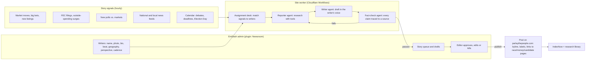

# The Parlay Newsroom: AI writers (and real ones) as editorial staff

Status: architecture, written 2026-10-05. Build starts next session.

## What we're building

A newsroom inside Parlay the People where the editor (the site owner) manages a staff of writers from the EmDash admin. Each writer has a name, photo, bio, age, beat, geography, perspective and publishing rhythm. AI writers find stories in the site's own data and in current and local news, research them with the analyst's tools, write drafts, pass an automated fact-check, and land in an editor's queue (or publish on their own, for formats the editor trusts). Human writers use the same profiles and bylines, and can use the AI desk as a research assistant.



## The parts, and where each lives

| Part | Where | Why there |
| --- | --- | --- |
| Writer profiles | EmDash bylines (name, slug, bio, photo; author pages at `/authors/<slug>/` already exist) + a `newsroom_writers` record with the agent settings | Bylines already render on posts and author pages; the extra settings drive the agents |
| Admin screens | A native EmDash plugin, **Newsroom**: pages for Writers, Story queue, Drafts, Sources, Settings | Native plugins run with the site's authority, can render React admin pages and create content; a sandboxed plugin can't reach the AI and D1 bindings the engine needs |
| Story signals | Site worker cron (already runs every minute) | It already watches markets for alerts |
| Reporting, writing, fact-checking | One Cloudflare Workflow per story (like `BriefingWorkflow` today) | Durable: a story's steps retry and resume; each step is billed and logged |
| Research tools | The analyst's existing tools (`lib/ai-tools.ts`) plus news tools | Every number already comes from our own data |
| Drafts and posts | EmDash `posts` collection via the content API, as drafts first | The editor uses the normal post editor to review and publish |
| Records | D1 tables (below) | Queue, source logs, costs and approvals in one place |

To verify on day one: how a native plugin's admin page reads and writes the `newsroom_*` D1 tables (directly through the site's bindings, or through plugin storage the worker can also read), and how it creates a byline and a draft post with the byline attached.

## Writer profile: what the editor sets in the admin

| Field | Example | What it controls |
| --- | --- | --- |
| Name, photo, bio | "Dana Whitfield", portrait, short bio | The byline and author page |
| Age | 41 | Persona detail on the author page (optional) |
| Kind | AI writer / human writer | AI writers get the AI disclosure everywhere (see Rules) |
| Beats | Senate races, National security, Agriculture, Money in politics, Polls, World politics | Which signals and news they pick up |
| Geography | National · Ohio · Ohio + Michigan · Cleveland | Which races, local news and state data they cover |
| Perspective | Strong D · Lean D · Neutral · Lean R · Strong R | The lens for analysis and opinion (see below) |
| Formats | News brief · Market analysis · Opinion column · Weekly roundup · Explainer | What they write; each format has its own template and length |
| Cadence | 2 posts a week · up to 1 a day · only on big moves | How often we hear from them: a target rate, a daily cap, active days/hours, and whether breaking signals can exceed the target |
| Triggers and thresholds | Odds move of 5+ pts; outside spending over $1M in a week | What counts as news for this writer |
| Voice | "Plainspoken, short sentences, Midwest examples, wry" + 2-3 sample paragraphs | Style instructions for the writer agent |
| Sources | Extra RSS feeds; blocked domains | Their reading list beyond the defaults |
| Approval | Drafts only (default) · Auto-publish for chosen formats | Whether the editor must approve each post |
| Budget | $10/month AI cap | Stops the writer when the cap is reached |
| Active | On / Off / Vacation until a date | Pause without deleting |

## Perspective: setting a lean toward the GOP or the Democrats

A writer's perspective changes **the lens, not the facts**.

- **What it changes:** which angles they find interesting, what they argue in analysis and opinion, the voice, and which stories they choose within their beat. A Lean R writer on a Senate race might focus on the GOP candidate's path and the money behind them; a Lean D writer on the same race, on the Democrat's.
- **What it never changes:** the numbers, the odds, quotes, dates and who said what. Both writers draw on the same tools and pass the same fact-check, which doesn't know or care about perspective.
- **Labels:** every post from a writer with a lean is published as **Perspective** (opinion), with a line under the byline: "Dana writes from a conservative perspective." Neutral writers can publish **News**.
- **Balance options:** "Debate pairs" assign the same big story to a Lean D and a Lean R writer at once and publish them side by side ("Two views on Maine"); a balance meter in the admin shows the past 30 days of output by perspective.

## Where the news comes from (free sources only)

Per the free-data-only rule, every source is free:

| Source | What it gives the writers | Notes |
| --- | --- | --- |
| Parlay's own data | Odds and moves, trades and whales, polls, FEC money and outside spending, LunarCrush buzz, past results, calendar | The core of every story, and what makes them ours |
| Google News RSS searches | Current national and local headlines for any beat or place ("Ohio Senate", "farm bill", "Cleveland mayor") | Already used by the collector; one search per writer beat × geography |
| Publishers' and local papers' RSS | Regional coverage by state and city | A starter list per state, editable in Sources |
| GDELT DOC API | Worldwide and local news by place and topic, updated every 15 minutes | Free; good for local and world beats |
| Government feeds | Governors' and secretaries of state press releases, Congress.gov (free key), FEC | Primary sources; best for elections and policy beats |

Writers read articles to understand them, but posts **summarize and link**, with short attributed quotes at most. They never republish article text (licensing).

## The story pipeline

1. **Signals (hourly cron).** Collect candidate stories: data triggers (moves, money, polls, listings, calendar) and new headlines for each beat × geography. Score each by size of move, money, recency and local relevance.
2. **Assignment desk.** Match stories to writers by beat, geography, format and cadence. Skip writers over their rate or budget, and skip stories already covered in the last N days unless it's a debate pair. Write `newsroom_assignments`.
3. **Reporter agent (Workflow step).** Researches with tools: race detail, odds history, trade flow, polls, FEC, buzz, related markets, headlines (fetch and read the linked articles). Saves a **source log**: every figure with the tool call or URL it came from.
4. **Writer agent.** Writes the draft from the source log only, in the writer's voice, format and perspective: headline, dek, body, "what to watch", links to race, money, candidate and state pages, and a suggested featured image (a chart rendered with Browser Rendering, like the share images).
5. **Fact-check agent.** A separate model call with the draft and the source log. It marks each claim as supported, unsupported or contradicted, checks quotes against the articles, flags claims about real people that aren't sourced, and checks the label (Perspective vs. News). Fail → back to step 3 once, then drop with a reason in the queue.
6. **Editor's queue.** The draft is saved as an EmDash draft post with the byline, category, tags and an attached "Sources and checks" panel. The editor approves, edits or kills it. Auto-publish formats skip the wait but are still listed.
7. **Publish.** Goes live; IndexNow ping; linked from the relevant race and candidate pages; added to the research library so the analyst can cite it.

Expected cost per post on GLM 5.3: about 5 to 20 cents (research, draft and check).

## Rules baked into every writer

- **AI writers are disclosed.** An "AI writer" badge on bylines and author pages, and a line in the bio ("Dana is an AI writer on the Parlay Newsroom, edited by …"). Photos for AI writers are generated or illustrated portraits, never photos of real people. This keeps readers' trust, and it's what keeps a site with AI-written posts in good standing with search engines.
- **No invented facts, quotes or sources.** If the source log doesn't support it, it doesn't run.
- **Real people:** no unsourced claims about anyone's conduct; private individuals are left out; nothing that impersonates a real journalist or public figure.
- **Voting information comes from official sources.** Dates, deadlines and how-to-vote details come only from the calendar and state election offices, never from the model.
- **Markets are research, not betting advice,** the same as the analyst's rules.
- **Corrections:** a "Correct this" action on any post logs the correction and appends a dated correction note.

## Human writers

Same profile, without the AI badge. A human writer can:
- Write in the normal EmDash editor.
- Ask the Newsroom for a **research brief** on any story: the source log plus key numbers, without a draft.
- Turn on "story tips" to get signals from their beat by email or Slack.

## Data model (D1, binding `ACCOUNTS` or a new `NEWSROOM` database)

```sql
newsroom_writers     (id, byline_id, kind ai|human, age, beats json, geography json, perspective -2..2, formats json,
                      cadence json, triggers json, voice text, samples text, sources json, approval, budget_cents,
                      active, vacation_until, created, updated)
newsroom_signals     (id, kind, key, title, data json, score, geography, beats json, seen_at)
newsroom_assignments (id, writer_id, signal_id, format, status queued|researching|writing|checking|ready|published|dropped,
                      workflow_id, reason, created, updated)
newsroom_drafts      (assignment_id, post_id, headline, source_log json, check_report json, cost_usd, tokens, created)
newsroom_sources     (id, writer_id null=everyone, kind rss|gdelt|gov, url_or_query, geography, active)
newsroom_corrections (post_id, note, by, ts)
```

## Admin screens (Newsroom plugin)

- **Writers:** grid of staff cards (photo, name, beats, perspective chip, posts this week, next expected post). "Add writer" opens the profile form above; photo upload goes to the media library.
- **Story queue:** today's assignments by writer and status, with live progress; "assign this story to…" for manual tips.
- **Drafts:** ready drafts with the source log and fact-check report beside them; Approve, Edit in EmDash, Kill.
- **Balance:** posts by perspective, beat and state over 30 days.
- **Sources:** default feeds by state and beat, add or block sources.
- **Settings:** global daily cap, budget, model choice, debate pairs on/off, quiet hours.

## Build plan

1. **Day 1: foundations.** Newsroom plugin skeleton with the Writers page and form; `newsroom_*` tables; bylines created from writer profiles with the AI badge; author pages show bio, age and disclosure.
2. **Day 2: one writer, end to end.** Signals from our own data (market moves), assignment desk, the Workflow (research, write, check), and drafts landing in EmDash for approval.
3. **Day 3: news and local.** Google News RSS and GDELT per beat × geography, government feeds, article reading with short quotes and links.
4. **Day 4: perspectives and formats.** Perspective lens and labels, opinion vs. news, debate pairs, weekly roundups, chart images.
5. **Day 5: the editor's tools.** Balance view, budgets, corrections, story tips for human writers, Slack/email notices of new drafts.

## Decisions for the editor

- The first three writers: names, beats, geography and perspective.
- Whether any format may auto-publish, or everything waits for approval at first (recommended: approval first).
- Photo style for AI writers (illustrated portraits recommended).
